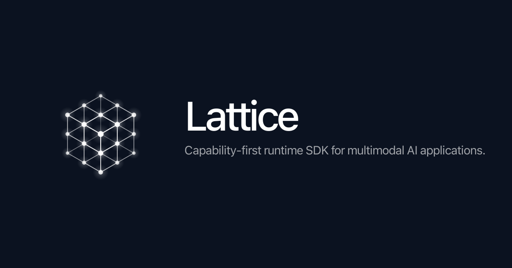
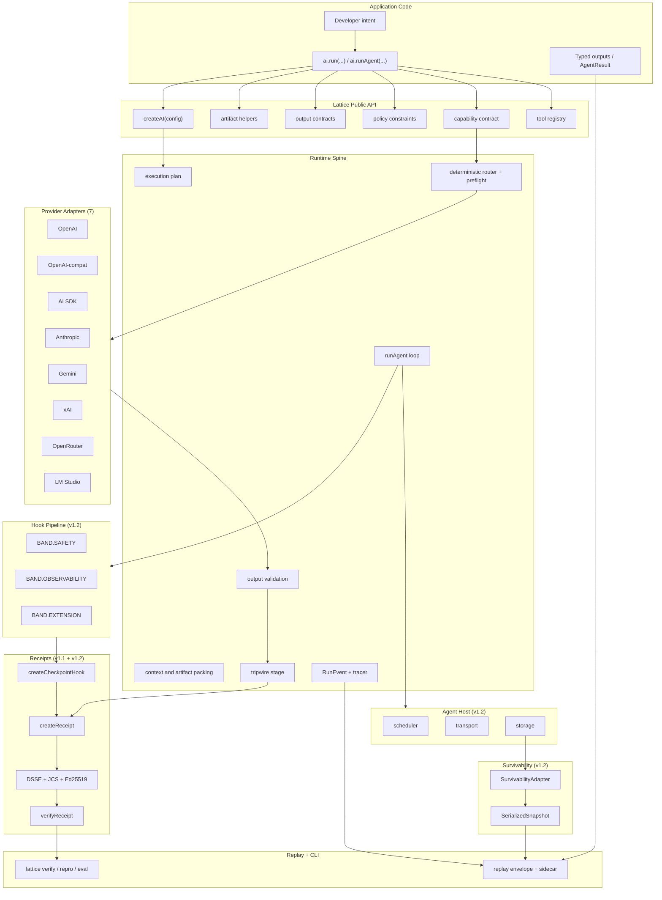

[](https://www.npmjs.com/package/@full-self-browsing/lattice)  

<div align="center">


# Lattice

**Capability-first runtime SDK for multimodal AI applications**

Describe the job. Attach any mix of artifacts. Declare the outputs you want. Set policy constraints. Lattice owns the route, the packaging, the validation, the signed audit trail, and the inspectable plan.


[Overview](#overview) · [Quick Start](#quick-start) · [What's New in v1.3](#whats-new-in-v13) · [v1.2](#whats-new-in-v12-shipped) · [Receipts](#capability-receipts) · [Agents](#agent-capability) · [Providers](#provider-adapters) · [CLI](#cli) · [Architecture](#architecture) · [Roadmap](#roadmap)

</div>

---

## Overview

Lattice is a TypeScript-first capability runtime SDK for AI applications. It is built for developers who want to process mixed text, images, audio, video, files, JSON, and tool results without wiring together separate chat, transcription, speech, file, memory, provider, routing, receipt, agent, and replay abstractions by hand.

The beginner path is intentionally small.

```ts
await ai.run({
  task: "Resolve this support case",
  artifacts: [artifact.text("Customer was charged twice.")],
  outputs: {
    answer: "text",
    action: z.object({
      kind: z.enum(["refund", "replace", "escalate", "clarify"]),
      reason: z.string(),
    }),
  },
  policy: { maxCostUsd: 2, privacy: "sensitive" },
});
```

The v1.2 surface adds two things on top of the same call. A **capability contract** with pre-flight checks, tripwires, signed receipts, replay envelopes, and a CLI for verify and eval. A **runtime-agnostic agent loop** with a tool-use protocol that works across seven provider adapters, per-iteration signed receipts, and host seams for scheduler, transport, and storage.

<div align="center">



</div>

> **Status:** v1.3.0 is live on npm as the first stable public release under @full-self-browsing. Both packages publish through npm OIDC Trusted Publisher with provenance attestations. The release includes model aware routing metadata, provider capability negotiation, prompt scaffolds, output sanitizers, tool call validation, receipt v1.2 metadata, and opt in multi agent crews. Canary validation is next.

---

## The Problem

Modern AI features are rarely just "send a prompt to a model." A real product flow might need a user message, a screenshot or product photo, a PDF policy document, a call recording or transcript, structured JSON output, citations back to source artifacts, budget and privacy and latency and provider constraints, a tamper-evident audit trail of what the model actually did, and a plan that explains what happened when something fails.

Without a runtime layer, every app rebuilds the same machinery. File normalization. Model selection. Prompt packing. Provider-specific message shapes. Schema validation. Retries. Fallbacks. Logging. Replay. Audit. Survival across service-worker eviction or worker freeze. Multi-iteration agent loops with cost ceilings.

## The Lattice Approach

Lattice treats the job as a capability request instead of a provider call.

| You provide | Lattice owns |
|---|---|
| Task intent | Runtime plan and execution boundary |
| Artifacts | Artifact references, metadata, lineage, transport choices |
| Desired outputs | Text, Standard Schema/Zod JSON, citations, generated artifact refs |
| Policy | Budget, latency, privacy, provider allow/deny, upload/logging constraints |
| Capability contract (optional) | Pre-flight budget check, tripwire invariants, signed receipts |
| Tool registry (optional) | Multi-iteration agent loop with native tool-use protocol |
| Host adapter (optional) | Scheduler, transport, storage seams for runtime-agnostic execution |

The result is a typed `RunResult` (or `AgentResult` for the agent loop) with either validated outputs or a structured failure. The execution plan grows into the audit trail. The receipt is the signed, JCS-canonical, DSSE-enveloped record of what actually happened.

---

## What's New in v1.3

v1.3.0 is the first stable public release of Lattice under the `@full-self-browsing` npm scope. It turns the runtime into a published SDK with provenance, model aware routing metadata, safer provider adapters, and opt in multi agent crews.

### Stable packages

Both packages are live on npm with `latest` pointing at `1.3.0`.

| Package | Version | Proof |
|---|---:|---|
| `@full-self-browsing/lattice` | `1.3.0` | npm provenance attestation |
| `@full-self-browsing/lattice-cli` | `1.3.0` | npm provenance attestation |

Release proof:

* GitHub Release: https://github.com/fullselfbrowsing/Lattice/releases/tag/v1.3.0
* Runtime package: https://www.npmjs.com/package/@full-self-browsing/lattice/v/1.3.0
* CLI package: https://www.npmjs.com/package/@full-self-browsing/lattice-cli/v/1.3.0
* `npm audit signatures` verifies registry signatures and attestations in a clean consumer install.

### Model aware runtime

The runtime now has a clearer view of provider and model behavior before it sends a request.

* Model capability registry with 337 profiles.
* Adapter quirk metadata for OpenAI, OpenAI compatible gateways, Anthropic, Gemini, xAI, OpenRouter, and LM Studio.
* Capability negotiation through `negotiateCapabilities(adapter, modelId)`.
* Prompt scaffold helpers through `getStructuredOutputContract`, `getToolUseContract`, `PROMPT_SCAFFOLD_VERSION`, and `PROMPT_STRATEGIES`.
* Optional output sanitizers for reasoning tags, chat template artifacts, and internal envelope leaks.
* Optional returned tool call validation against the caller supplied tool registry.
* Receipt v1.2 metadata with optional `modelClass`.

### Agent crews

Single agent execution remains the default path through `ai.runAgent(intent)`. v1.3 adds explicit crew composition for callers that want parent and child agent loops.

* `defineAgent`, `runAgentCrew`, and `createAI(...).runAgentCrew(...)` for structured crew runs.
* Structured child summaries with artifacts and receipt links.
* Shared crew budget caps.
* Rate limit coordination through `createRateLimitGroup` and `withRateLimit`.
* Parent receipt CID links through `parentReceiptCid`.

### Capability negotiation example

```ts
import { createAnthropicProvider, negotiateCapabilities } from "lattice";

const anthropic = createAnthropicProvider({ apiKey: process.env.ANTHROPIC_API_KEY });

// `quirks` is typed as AnthropicQuirks. Type narrowing follows adapter.id.
anthropic.quirks.supportsToolChoice;     // boolean
anthropic.quirks.parallelToolCalls;      // boolean
anthropic.quirks.structuredOutputs;      // boolean

// Live capability negotiation. Calls /v1/models and intersects with the local registry.
const caps = await negotiateCapabilities(anthropic, "claude-opus-4-7");
caps.supports.nativeToolCalling;         // boolean
caps.supports.extendedThinking;          // boolean
caps.knownFailureModes;                  // string[] (e.g. ["internal_envelope_leak"])
caps.recommendedSanitizers;              // SanitizerKey[] (e.g. ["unwrapInternalEnvelope"])
caps.source;                             // "live" | "registry" | "registry-fallback"
```

The same `negotiateCapabilities` helper works for every adapter. Auth failures throw a typed `NegotiationAuthError` (kind `"negotiation-auth-failed"`, with `adapter`, `modelId`, and `httpStatus: 401 | 403`). Transient `/models` failures fall back to registry data and emit a `capabilities.negotiation.fallback` event through the tracer so consumers can observe degraded mode without crashing.

### Test posture

| Workspace | Tests |
|---|---:|
| `packages/lattice` | 908 / 908 |
| `packages/lattice-cli` | 144 / 144 |
| Type-level (vitest typecheck + tsd) | 1089 / 1089 |
| **Workspace runtime total** | **1052 / 1052** |

Strict `tsc --noEmit` clean across both workspaces. `publint` and `@arethetypeswrong/cli` clean. ESM-only.

### Next

Canary validation now moves to a separate public consumer repository. It will install `@full-self-browsing/lattice@1.3.0` from npm, run fake provider coverage first, then add real provider checks behind explicit cost ceilings.

---

## What's New in v1.2 (Shipped)

v1.2 shipped two complete tracks on top of the v1.1 Capability Receipts foundation.

### Track A: FSB Integration

Five extensions landed as canonical Lattice surface.

| Surface | What it adds |
|---|---|
| Public surface index + packaging | `createReceipt` reachable via the bare `lattice` specifier. `pnpm-workspace` `catalog:` specifiers resolved to concrete versions so npm 11 can install via `file:`. |
| Receipt v1.1 schema + tripwire band pipeline + lifecycle events | `CapabilityReceiptBody.version` widens to `v1` or `v1.1` literal union with six optional step-marker fields. `createHookPipeline` ships SAFETY, OBSERVABILITY, EXTENSION bands with per-handler budget, frozen contexts, irreversible freeze. `HookLifecycleEvent` vocabulary. |
| Step-transition tracing + checkpoint hook | `step.transition` joins `RunEventKind`. `createCheckpointHook` emits exactly one event and, when a signer is configured, mints exactly one v1.1 receipt per invocation, threading step-markers as a linked list. |
| Provider adapters + INV-03 parity | Five new adapters: Anthropic Messages API, Gemini `generateContent`, xAI, OpenRouter, LM Studio. INV-03 parity smoke iterates all seven logical providers under a fake fetch and asserts the same `ProviderAdapter` contract. |
| Survivability adapter | `SurvivabilityAdapter<TState>` defines what "execution context can be evicted mid-flow" means for any runtime. `SerializedSnapshot` JSON round-trips byte-equal and survives DSSE + JCS round-trip when the payload embeds a v1.1 `ReceiptEnvelope` minted with real Ed25519. `createNoopSurvivabilityAdapter()` ships as the reference impl. |

### Track B: Agent Capability

The previously out-of-scope Delegation surface opened as a runtime-agnostic single-agent capability. v1.3 keeps `ai.runAgent(intent)` as the zero-config default and adds first-class crews through the explicit `AgentHost` / `runAgentCrew` surface.

| Surface | What it adds |
|---|---|
| Delegation policy flip + agent runtime entrypoint | `AGENTS.md` flips from "multi-agent: Out of Scope" to "agent execution: First-class, runtime-agnostic." `ai.runAgent(intent)` ships on the `createAI` runtime. `formatToolsForProvider` drives a uniform prompt-reencoded tool-use protocol across all seven provider adapters. SAFETY-band hooks can veto an iteration before provider invoke. |
| Pluggable `AgentHost` + recovery markers | `AgentHost` interface with three optional seams: scheduler, transport, storage. `createNoopAgentHost()` is the Node-test reference impl. Storage composes with `SurvivabilityAdapter` so the loop re-enters at the recorded step on resume. `RunEventKind` gains `recovery.start`, `recovery.complete`, `recovery.failed` markers, closing the one Important row left open by the v1.1 audit. |
| Agent infrastructure primitives | Five small standalone modules. `createCostTracker` handles budget-aware usage. `createTranscriptStore` handles filtered tail reads. `createGoalProgressTracker` detects stalled or regressed work. `createActionHistory` detects repeated actions and ping-pong tool-call patterns through `STUCK_REASONS`. `createPermissionContext` gates by tool, iteration, and resource pattern with a SAFETY-band hook helper. |
| Showcase + eval helper | `examples/agent-loop` exercises every surface end-to-end against a fake provider and a fake tool registry. Real Ed25519 signing. Three per-iteration receipts verified. `evalAgentRun(baseline, current, options?)` ships as a pure regression-gate kernel for iterations-to-goal and cost. |

### Test posture

| Workspace | Tests |
|---|---:|
| `packages/lattice` | 589 / 589 |
| `packages/lattice-cli` | 144 / 144 |
| **Workspace total** | **733 / 733** |

Strict `tsc --noEmit` clean across both workspaces.

### Documented v1.2 limitation

Native tool-use (Anthropic Messages-API `tools[]`, OpenAI Chat-Completions `tools[]`, Gemini `function_declarations`) was deferred to v1.3 at v1.2 ship time. Uniform prompt-reencoded mode satisfied the AGENT-02 contract across all seven providers, proved by 84 `describe.each(ALL_PROVIDERS)` cases. Admitting native tool-use cleanly required an additive extension to the `ProviderAdapter` interface that preserved the INV-03 7-provider parity contract.

v1.3 ships the typed surface that closes this. Each adapter now exposes `quirks.supportsToolChoice` and `quirks.parallelToolCalls` plus a runtime `NegotiatedCapabilities.supports.nativeToolCalling` field sourced from upstream `/models` responses where available. Returned prompt-reencoded tool-call envelopes can now be validated before the normalized response is exposed.

---

## Quick Start

### Requirements

* Node.js 24 or newer
* pnpm 10 or newer
* TypeScript 6

### Use from this repository

```bash
git clone https://github.com/fullselfbrowsing/Lattice.git
cd Lattice
pnpm install
pnpm build
pnpm test
```

### Install

The runtime SDK and the CLI are published as two scoped packages under `@full-self-browsing`.

```bash
# Runtime SDK
pnpm add @full-self-browsing/lattice
# or
npm install @full-self-browsing/lattice
```

```bash
# CLI (global)
pnpm add -g @full-self-browsing/lattice-cli
lattice --version
```

> The CLI package name is `@full-self-browsing/lattice-cli`, but the bin name is `lattice`. The user-facing command stays short even though the package is scoped (RENAME-2 from PITFALLS).

### Hello world (synchronous run)

```ts
import { z } from "zod";
import { artifact, createAI, output, type ProviderAdapter } from "lattice";

const fixtureProvider = {
  id: "fixture",
  kind: "provider-adapter",
  execute: async (request) => ({
    rawOutputs: {
      answer: "Refund approved.",
      action: { kind: "refund", reason: "duplicate charge" },
      evidence: [{ artifactId: "artifact:text:case-note", label: "case note" }],
      generated: [],
    },
  }),
} satisfies ProviderAdapter;

const ai = createAI({
  providers: [fixtureProvider],
  defaults: { policy: { maxCostUsd: 5, latency: "interactive" } },
});

const result = await ai.run({
  task: "Resolve this support case",
  artifacts: [artifact.text("Customer was charged twice.", { id: "artifact:text:case-note", label: "case note" })],
  outputs: {
    answer: "text",
    action: z.object({ kind: z.literal("refund"), reason: z.string() }),
    evidence: output.citations(),
    generated: output.artifacts({ artifactKind: "file" }),
  },
  policy: { maxCostUsd: 2, privacy: "sensitive", noLogging: true },
});

if (result.ok) {
  console.log(result.outputs.answer);
  console.log(result.outputs.action.reason);
} else {
  console.error(result.error);
  console.error(result.plan);
}
```

### Hello agent (multi-iteration tool-use loop)

```ts
import { createAI, createInMemorySigner, defineTool, generateEd25519KeyPairJwk } from "lattice";
import { z } from "zod";

const { jwk, kid } = await generateEd25519KeyPairJwk();
const signer = await createInMemorySigner({ jwk, kid });

const ai = createAI({ providers: [fixtureProvider], signer });

const result = await ai.runAgent({
  goal: "Find the total revenue from last quarter and send a summary email.",
  tools: [
    defineTool({ name: "query_sales", input: z.object({ quarter: z.string() }), output: z.object({ totalUsd: z.number() }), run: async () => ({ totalUsd: 384210 }) }),
    defineTool({ name: "send_email", input: z.object({ to: z.string(), body: z.string() }), output: z.object({ ok: z.boolean() }), run: async () => ({ ok: true }) }),
  ],
  outputs: { summary: "text" },
  contract: { budget: { maxIterations: 6, maxCostUsd: 0.50 } },
});

if (result.ok) {
  console.log(result.outputs.summary);
  console.log(`iterations=${result.iterations.length} receipts=${result.receipts.length}`);
}
```

Each iteration emits a `step.transition` event through the hook pipeline. When a signer is configured, the auto-registered checkpoint hook on `BAND.OBSERVABILITY` mints exactly one v1.1 capability receipt per iteration. The receipt body carries `stepName`, `stepIndex`, `parentStepName`, `previousStepName`, `sessionId`, and `timestamp` so receipts thread as a linked list across the agent run.

---

## Capability Receipts

A capability receipt is a JCS-canonicalized, DSSE-enveloped record of one execution boundary. Receipts cover the success path and every failure path, so a tripwire violation or a contract rejection produces a verifiable receipt the same way a success does.

```ts
import { contract, inv, createInMemorySigner, generateEd25519KeyPairJwk, verifyReceipt, createMemoryKeySet } from "lattice";

const myContract = contract({
  task: "support-refund",
  budget: { maxCostUsd: 0.10 },
  invariants: [
    inv.noPII("answer"),
    inv.mustCite("answer", { fromArtifacts: ["case-note"] }),
    inv.qualityFloor("answer", { minScore: 0.8, suite: "examples/work-inbox/.lattice/quality-suite" }),
  ],
});

const { jwk, kid } = await generateEd25519KeyPairJwk();
const ai = createAI({
  providers: [fixtureProvider],
  signer: await createInMemorySigner({ jwk, kid }),
});

const result = await ai.run({ task: "...", contract: myContract, /* ... */ });

// Later, in another process:
const keySet = createMemoryKeySet([{ kid, jwk, state: "active" }]);
const verdict = await verifyReceipt(result.receipt!, keySet);
verdict.ok; // true
```

The receipt body commits to:

* The contract hash (sha256 of canonical contract).
* The route the runtime took, including pricing and pre-flight estimate.
* The normalized usage (prompt tokens, completion tokens, cost USD as I-JSON string).
* The model both requested and observed.
* The output hash on success, or a typed failure on tripwire violation or no-contract-match.
* When step-markers are populated, the receipt auto-bumps to `lattice-receipt/v1.1` with the six step-marker fields threading the linked list.

---

## Provenance Verification

Every `@full-self-browsing/lattice` and `@full-self-browsing/lattice-cli` release is published via npm OIDC Trusted Publisher with provenance attestations attached automatically. The stable v1.3.0 publish is live for both packages, and `latest` points at `1.3.0`.

```bash
npm view @full-self-browsing/lattice@1.3.0 --json | jq .dist
npm view @full-self-browsing/lattice-cli@1.3.0 --json | jq .dist
# then inspect each .dist.attestations.provenance entry
```

See `SECURITY.md` for the full supply-chain posture: no long-lived `NPM_TOKEN`, SHA-pinned GitHub Actions, `npm-publish` manual reviewer gate for the first three publishes.

---

## Agent Capability

`ai.runAgent(intent)` drives a tool-use loop with native composition surfaces.

### Composition surfaces

* `pipeline?` is the `HookPipeline`. The runtime creates one if absent.
* `signer?` is the `ReceiptSigner`. When present, the runtime auto-registers `createCheckpointHook` on `BAND.OBSERVABILITY` for per-iteration receipts.
* `tracer?` is the `TracerLike`. Flows through the pipeline.
* `outputs?` is a final-answer schema map. Validated only on the final assistant message.
* `contract?` is the `CapabilityContract`. Budget invariants enforced pre-iteration.
* `host?` is the `AgentHost`. Scheduler, transport, storage seams plug in additively.
* `survivabilityAdapter?` is the `SurvivabilityAdapter<TState>`. Composes with `host.storage` for cross-process resume.

### Agent infrastructure primitives

Five small, pure, composable modules. Wire them into the loop through hook handlers.

| Primitive | What it does |
|---|---|
| `createCostTracker` | Accumulates per-iteration `Usage`. Reports `ok`, `warning`, `exceeded` against `contract.budget`. |
| `createTranscriptStore` | Records the message log. Tail reads preserve the first user turn under token-budget pressure. |
| `createGoalProgressTracker` | Caller declares a goal. Tracker reports `progressing`, `stalled`, `regressed`. |
| `createActionHistory` | Detects consecutive-identical and ping-pong tool-call patterns. Exposes the `STUCK_REASONS` vocabulary. |
| `createPermissionContext` | Gates tool execution per tool, per iteration, per resource pattern. SAFETY-band hook helper integrates with `controls.deny(reason)`. |

### Cross-process resume (survivability)

```ts
import { createNoopAgentHost, createNoopSurvivabilityAdapter, runAgent } from "lattice";

const survivabilityAdapter = createNoopSurvivabilityAdapter<AgentSnapshot>();
const host = createNoopAgentHost({ storage: chromeStorageSessionAdapter });

const result = await ai.runAgent({
  goal: "...",
  tools,
  host,
  survivabilityAdapter,
});
```

On run start, `runAgent` calls `host.storage?.load()`. If a snapshot exists, the adapter deserializes it, the loop re-enters at the recorded iteration index, cumulative usage carries across the process boundary, and the tracer emits `recovery.start` followed by `recovery.complete` (or `recovery.failed` if the snapshot is corrupt, in which case storage is cleared and the loop starts fresh).

### Eval gate

```ts
import { evalAgentRun } from "lattice";

const eval_ = evalAgentRun(baseline, current, {
  iterationToleranceFactor: 1.5,
  maxCostRatio: 1.10,
});

if (!eval_.ok) {
  console.error(eval_.regressions);
  process.exit(1);
}
```

---

## Provider Adapters

| Provider | Factory | Negotiate mode (v1.3) | Notes |
|---|---|---|---|
| OpenAI | `createOpenAIProvider` | Registry-only with `/v1/models` existence check | v1.0 baseline. `quirks: OpenAIQuirks` (5 base + `strictModeSupported` + `structuredOutputsTier2`). 401/403 throws `NegotiationAuthError`. |
| OpenAI-compatible gateways | `createOpenAICompatibleProvider` | Registry-only (no `/models` call) | v1.0 baseline. `quirks: OpenAICompatQuirks` (5 conservative defaults). Source: `"registry"`. |
| AI SDK | `createAISdkProvider` | n/a (host SDK owns lifecycle) | v1.0 baseline. Quirks surface inherits from underlying adapter. |
| Anthropic | `createAnthropicProvider` | Thick reference (live `/v1/models`) | v1.2 adapter with v1.3 negotiation. `quirks: AnthropicQuirks`. `supports.*` populated directly from upstream capabilities block (`extendedThinking`, `nativeToolCalling`, `structuredOutputs`). |
| Gemini | `createGeminiProvider` | Medium-thick (live `/v1beta/models`) | v1.2 adapter with v1.3 negotiation. `quirks: GeminiQuirks` (8 booleans). `inputTokenLimit -> contextWindow`, `thinking -> extendedThinking`, `supportedGenerationMethods -> streaming + nativeToolCalling`. `x-goog-api-key` header. |
| xAI | `createXaiProvider` | Lenient-parse (`/models`) | v1.2 adapter with v1.3 negotiation. `quirks: XaiQuirks`. Undocumented `/models` shape falls back to registry if `Array.isArray(body.data)` fails. Preserves the `reasoning_tokens` quirk. |
| OpenRouter | `createOpenRouterProvider` | Medium-thick (live `/api/v1/models`) | v1.2 adapter with v1.3 negotiation. `quirks: OpenRouterQuirks`. Rich `top_provider.context_length` and `supported_parameters` intersection. Sends NO Authorization header to `/models`. `stripOpenRouterVariant` normalizes `:free`/`:thinking` suffixes. |
| LM Studio | `createLmStudioProvider` | Registry-only | v1.2 adapter with v1.3 negotiation. `quirks: LmStudioQuirks` (5 base + `customChatTemplateRiskFlag` + `noAuthRequired`). `apiKey` optional. |

The INV-03 parity smoke (`providers/parity.test.ts`) iterates all seven logical providers under a fake fetch and asserts the same `ProviderAdapter` contract: shape, `rawOutputs` population, normalized `Usage`, provider-name in error on non-OK, `AbortSignal` propagation, `rawResponse` preservation, distinct request ids.

The v1.3 capability negotiation surface adds three uniform behaviors across all seven adapters. Each `negotiateCapabilities(modelId)` call: caches per-adapter with a TTL, coalesces concurrent inflight requests on the same `modelId` (cleared in `.finally`), retries transient failures with `[0, 200, 1000]ms` backoff, and times out at 30 seconds via `AbortSignal.timeout`. A 7-adapter quirks smoke (`capabilities-negotiate-integration.test.ts`) plus the D-04 consumer-adapter fallback test confirm the contract holds end-to-end through the top-level `negotiateCapabilities` helper.

---

## CLI

`packages/lattice-cli` ships three subcommands.

```bash
# Verify the Ed25519 signature on every receipt in a directory.
lattice verify --receipts ./.lattice/receipts --key ./keyset.json

# Replay a receipt against a sidecar to confirm the output hash matches.
lattice repro <receipt-id> \
  --sidecar-dir ./.lattice/sidecars \
  --fixtures ./.lattice/fixtures \
  --key ./keyset.json

# Run an eval suite with baseline-relative regression gating.
lattice eval \
  --fixtures ./.lattice/fixtures \
  --sidecar-dir ./.lattice/sidecars \
  --baseline ./.lattice/baseline.json \
  --key ./keyset.json
```

`lattice eval --agent` for the agent-loop kernel is deferred to v1.3. The `evalAgentRun` regression gate ships in the package surface so callers can wire it into their own CI.

---

## Showcases

### `examples/work-inbox` (v1.1)

Four scenarios. Success, tripwire-violated, no-contract-match, quality-floor. Each writes a signed Ed25519 receipt and a sidecar to `./.lattice/`. Replayable via `lattice repro`. Evaluable via `lattice eval`.

```bash
pnpm example:work-inbox
```

### `examples/agent-loop` (v1.2)

The agent loop showcase. A fake provider, two fake tools (`query_sales`, `send_email`), a hook pipeline with PermissionContext at SAFETY and the auto-registered checkpoint hook at OBSERVABILITY, all five infrastructure primitives wired through hooks, real Ed25519 signing, and `evalAgentRun` as the final gate.

```bash
node examples/agent-loop/index.mjs
# iterations=3 receipts=3 verified=true
# cost.total=0.0006 goalProgress=progressing eval.ok=true
```

---

## Architecture

<div align="center">


</div>



### Package shape

```text
Lattice/
|-- packages/
|   |-- lattice/                # core package
|   |   `-- src/
|   |       |-- agent/          # runAgent, AgentHost, format-tools, infra primitives, evalAgentRun
|   |       |-- artifacts/      # artifact references and helpers
|   |       |-- contract/       # contract, invariants, bands, checkpoint, preflight, tripwire
|   |       |-- outputs/        # output contracts, inference, validation
|   |       |-- plan/           # execution plan
|   |       |-- policy/         # policy contracts and merging
|   |       |-- providers/      # 7 provider adapters + parity smoke
|   |       |-- receipts/       # JCS, DSSE, Ed25519, KeySet, createReceipt, verifyReceipt
|   |       |-- replay/         # replay envelope, materialize, replayOffline, rerunLive
|   |       |-- results/        # typed run / agent success and failure unions
|   |       |-- runtime/        # createAI facade, survivability adapter
|   |       |-- sessions/       # session refs
|   |       |-- storage/        # artifact store
|   |       |-- tools/          # defineTool, runTool, importMcpTools
|   |       `-- tracing/        # RunEventKind, TracerLike
|   `-- lattice-cli/            # verify, repro, eval subcommands
|-- examples/
|   |-- work-inbox/             # v1.1 showcase (four scenarios)
|   `-- agent-loop/             # v1.2 showcase (fake provider + signed iteration receipts)
|-- assets/                     # brand assets (mark, wordmark, app icon, favicons, social card, spin gif)
|-- tools/
|   `-- gen-assets.mjs          # regenerate brand assets from the design-canvas renderer
|-- .planning/                  # project plans, state, milestone audits
|-- package.json
|-- pnpm-workspace.yaml
`-- tsconfig.base.json
```

---

## Roadmap

| Milestone | Goal | Status |
|---|---|---|
| v1.0 | Runtime API, output contracts, artifacts, deterministic routing, sessions, provider packaging, tools, replay, work-inbox showcase | Shipped (2026-04-22) |
| v1.1 Capability Receipts | Capability contract, tripwires, JCS canonicalization, Ed25519 signing, receipt verification, replay envelope, `lattice` CLI, eval CI gate, sidecar support | Shipped (2026-05-12) |
| v1.2 FSB Integration + Agent Capability | Receipt v1.1 schema extension, hook bands, checkpoint hook, 5 new providers + INV-03 parity, survivability adapter, agent runtime, agent host, agent infrastructure primitives, agent-loop showcase, eval helper | Shipped (2026-05-31) |
| **v1.3 Public Release + Model Aware SDK** | **Stable npm packages, provenance backed release, capability registry, provider negotiation, prompt scaffolds, sanitizers, tool call validation, receipt v1.2 model metadata, and opt in crew orchestration.** | **Shipped stable v1.3.0 on 2026-06-11. Canary validation continues in a separate public consumer repo.** |

Multi-agent crews (parent-child loops, summary-return, cache-prefix sharing, rate-limit-group coordination) are first-class through the opt-in `AgentHost` / `runAgentCrew` surface.

---

## Development

```bash
# Install workspace dependencies
pnpm install

# Build all packages
pnpm build

# Typecheck all packages
pnpm typecheck

# Run unit tests (1052 across the workspace)
pnpm test

# Run declaration / type API tests
pnpm test:types

# Verify package publishing shape
pnpm lint:packages

# Regenerate brand assets after a design change
node tools/gen-assets.mjs
```

### Quality gates

* TypeScript strict mode
* `exactOptionalPropertyTypes`
* `noUncheckedIndexedAccess`
* Vitest runtime tests
* Vitest typecheck tests
* `tsd` declaration tests
* `publint`
* `@arethetypeswrong/cli`
* INV-03 7-provider parity smoke

---

## Brand assets

Direction C ("Shell") from the [Claude.ai Design](https://claude.ai/design) bundle. Isometric wireframe lattice cube, hollow faces, glowing depth-scaled nodes, ink `#0b1220` on white. Wordmark in Outfit Medium with `-0.03em` tracking.

| Asset | File |
|---|---|
| Animated mark (in-plane rotation, light) | [`assets/logo-mark-spin.gif`](assets/logo-mark-spin.gif) |
| Animated mark (in-plane rotation, dark) | [`assets/logo-mark-spin-dark.gif`](assets/logo-mark-spin-dark.gif) |
| Animated mark, SMIL SVG (browsers, GitHub raw) | [`assets/logo-mark-spin.svg`](assets/logo-mark-spin.svg) |
| Static mark, light | [`assets/logo-mark.svg`](assets/logo-mark.svg) · [`assets/logo-mark.png`](assets/logo-mark.png) |
| Static mark, dark | [`assets/logo-mark-dark.svg`](assets/logo-mark-dark.svg) · [`assets/logo-mark-dark.png`](assets/logo-mark-dark.png) |
| Wordmark, light | [`assets/logo-wordmark.svg`](assets/logo-wordmark.svg) · [`assets/logo-wordmark.png`](assets/logo-wordmark.png) |
| Wordmark, dark | [`assets/logo-wordmark-dark.svg`](assets/logo-wordmark-dark.svg) · [`assets/logo-wordmark-dark.png`](assets/logo-wordmark-dark.png) |
| App icon | [`assets/app-icon.svg`](assets/app-icon.svg) · [`assets/app-icon-1024.png`](assets/app-icon-1024.png) · [`assets/app-icon-512.png`](assets/app-icon-512.png) · [`assets/app-icon-256.png`](assets/app-icon-256.png) |
| Favicons | [`assets/favicon-48.svg`](assets/favicon-48.svg) · [`assets/favicon-32.svg`](assets/favicon-32.svg) · [`assets/favicon-16.svg`](assets/favicon-16.svg) |
| Social card (1200 × 630) | [`assets/social-card.svg`](assets/social-card.svg) · [`assets/social-card.png`](assets/social-card.png) |

To regenerate the assets after a design change, edit `tools/gen-assets.mjs` and run `node tools/gen-assets.mjs`. The script ports the parametric isometric 3D renderer from the original design bundle's `lattice-core.js` so every asset stays driven by the same real 3D math (rotate, project, depth-sort, fixed-fit projection for constant silhouette under in-plane spin).

---

## Design Principles

* **Capability first.** Users describe the job and the outputs they want, not the provider-specific API call.
* **Small public surface.** The beginner path stays one `run` call with artifacts, outputs, and policy.
* **Provider-neutral core.** Provider SDK types stay behind adapters. The seven shipped adapters all conform to one `ProviderAdapter` contract.
* **Deterministic routing.** Early routing is explainable and reproducible, not opaque model magic.
* **Artifacts everywhere.** Inputs, outputs, tool results, transcripts, generated files, and provider handles all become traceable artifacts.
* **Inspectable execution.** Every run explains model choice, context packing, artifact transforms, cost, latency, fallbacks, and validation.
* **Signed audit trail.** Every execution boundary that ships a contract emits a JCS-canonicalized, DSSE-enveloped, Ed25519-signed receipt. Success and failure both produce verifiable receipts.
* **Runtime-agnostic.** The agent loop, the host adapter, and the survivability adapter compose without coupling to `chrome.*`, `importScripts`, or service-worker idioms.

---

## Contributing

1. Fork the repository.
2. Create a feature branch.
3. Run `pnpm install`.
4. Make focused changes that preserve the small public API.
5. Run `pnpm typecheck`, `pnpm test`, and `pnpm test:types`.
6. Open a pull request with the behavior change, test coverage, and any public API implications.

Architecture notes for contributors. Keep `packages/lattice/src/index.ts` intentionally small. Keep provider SDK details out of public exports.

---

## License

[MIT](LICENSE)

---

<div align="center">


Built by [Lakshman Turlapati](https://github.com/LakshmanTurlapati). Maintained at [`fullselfbrowsing/Lattice`](https://github.com/fullselfbrowsing/Lattice).

If Lattice helps you build cleaner multimodal AI features, consider giving it a star.

[Back to top](#lattice)

</div>
